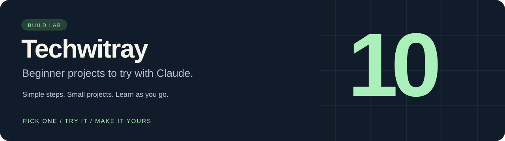

# Techwitray

**10 beginner-friendly projects to try with Claude.**

Pick one. Try the example. Make a small change.

**New here? Start with the [Spending tracker](projects/01-expense-analyzer/README.md).** It adds up sample expenses so you can see where the money goes.

## Pick a project

Click a name for simple steps and a prompt you can copy into Claude.

<!-- PROJECTS_START -->
| Project | What it does | Level |
| --- | --- | --- |
| 1. [Spending tracker](projects/01-expense-analyzer/README.md) | See where your money goes. | Easy |
| 2. [Unpaid invoice tracker](projects/02-invoice-tracker/README.md) | See who still needs to pay you. | Easy |
| 3. [Restock helper](projects/03-inventory-planner/README.md) | See which shop items need restocking. | Medium |
| 4. [Customer message sorter](projects/04-support-triage/README.md) | Sort sample messages into teams. | Medium |
| 5. [Meeting to-do list](projects/05-meeting-actions/README.md) | Keep track of tasks and who owns them. | Easy |
| 6. [Social media link builder](projects/06-campaign-links/README.md) | Make labeled links for your posts. | Easy |
| 7. [Resume checker](projects/07-job-match/README.md) | Spot skills mentioned in a job but missing from a resume. | Medium |
| 8. [Book finder](projects/08-book-finder/README.md) | Browse a short list of real books. | Medium |
| 9. [Filming weather planner](projects/09-weather-planner/README.md) | Compare days for an outdoor shoot. | Medium |
| 10. [GitHub project checklist](projects/10-repo-check/README.md) | Check a project’s basic information. | Medium |
<!-- PROJECTS_END -->

## Try one yourself

1. **See an example:** Open a project above and click **See the example**. Nothing to install.
2. **Ask Claude for help:** Copy that project's short prompt into your Claude chat.
3. **Run the ready-made version:** Follow the [simple setup guide](docs/START_HERE.md), then choose a project from the numbered menu.

The ready-made examples run on your computer without a Claude account or API key. You only need Claude if you want its help.

[Start here →](docs/START_HERE.md)

---

[Sources](SOURCES.md) · [Reel script](docs/REEL.md) · [Extra details](docs/ADVANCED.md) · [License](LICENSE)

Practice business data is made up. Books, weather and GitHub examples use saved public data; saved weather is not today's forecast.
